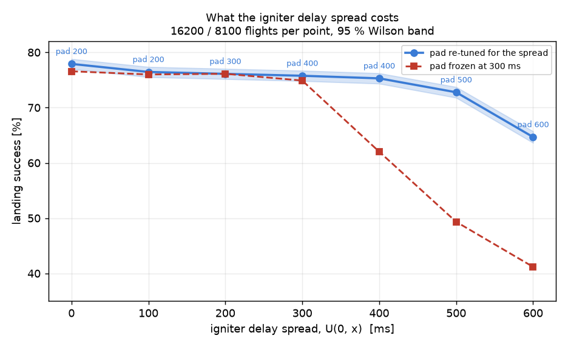

# LandSim Light

1D (vertical axis only) simulation of a propulsive landing of a small rocket with
a solid motor that can only be throttled by thrust-spoiler flaps.

## Model

* Rocket: 3.2 kg gross (277 g propellant), 105 mm diameter, Cd = 0.35, ISA sea-level air.
* Motor: thrust curve reconstructed from the fraction-of-peak / rise-time / decay-time
  table by linear interpolation between the tabulated points
  (burn ≈ 2.61 s, peak 120.4 N, total impulse ≈ 222 Ns).
* Throttling: flaps block up to 90 % of the thrust, so the effective thrust is
  `throttle * F_motor(t)` with `throttle ∈ <0.1, 1.0>`. The blocked thrust is
  **wasted** – the propellant burns according to the nominal curve, so the burn
  time and the mass history do not depend on the throttle setting.
* The throttle profile is split into 100 ms phases; every phase has its own value.

## What it computes

For a free fall from a configurable altitude (default 150 m) it searches, with a
vectorised differential-evolution optimiser over the throttle profile, the range of
ignition altitudes for which a touchdown below 3 m/s is achievable, and prints the
lowest and the highest such altitude together with the throttle / thrust profile.

## Extra knobs

* `--motor long|short` (GUI: radio buttons) switches between the two motor lookup
  tables — both burn the same 277 g of propellant:
  * **long** – 120.4 N peak, 2.613 s burn, 221.8 Ns
  * **short** – 269.4 N peak, 1.554 s burn, 258.8 Ns
* `--thrust-mult` (GUI: *Thrust multiplier*) scales the whole motor lookup table by a
  float > 0 before the simulation starts; everything else (burn time, mass history)
  stays as it is.
* `--search-min` / `--search-max` (GUI: *Search from* / *Search to*) limit the range of
  ignition altitudes that is searched.
* The feasible set is treated as a single contiguous window, so the coarse scan stops
  at the first failure after a series of successes.
* The report also gives the time from the release down to each of the two ignition
  altitudes and the resulting time window for the ignition command.

## Klima D9 boosters (third mode)

On top of the throttled main motor the rocket may carry up to N **Klima D9**
boosters (curve from the manufacturer's RockSim file: 25 N peak, 2.242 s, 19.96 Ns,
27.1 g each, 16.1 g of it propellant). A booster is a pure on/off device: the
optimiser only chooses *whether* and *when* to light each one — once lit it burns
its whole curve and cannot be throttled, stopped or relit, and it may just as well
stay unused for the whole flight. The carried boosters' mass is added to the rocket
(`--no-booster-mass` turns that off).

* CLI: `--boosters 0..N`, `--booster-window` (how long after the main ignition a
  booster may still be lit, default main burn + 4 s).
* GUI: the *Klima D9 boosters* spinbox with its own ignition-window box.

With the long motor and the default vehicle the window of usable ignition altitudes
grows from 45.4–56.3 m (no booster) to 41.9–61.6 m (1) and 37.4–67.1 m (3).

## Side calculation: apogee from the ground

`ascent(cfg, throttle)` simulates a vertical launch from rest at ground level with
the same vehicle, motor and drag model and returns the apogee, the burnout state,
the peak speed and the peak acceleration. It is completely separate from the
landing search.

* CLI: printed before every run; `--ascent` runs only this, `--ascent-throttle`
  sets a constant throttle.
* GUI: the **Apogee from ground** button with its own throttle box.

With the default vehicle: **long** motor -> apogee ≈ 171 m (burnout 70.7 m, 45.8 m/s),
**short** motor -> apogee ≈ 264 m (burnout 61.7 m, 67.3 m/s, 7.8 g).

---

# 3-D / TVC mode (`tvc_sim.py`)

The 1-D modes ask *whether a soft landing is possible at all*. This one asks whether a
real controller flies it. Structure, gains and several of the hard-won details follow
[Landing-Rocket-Sim](https://github.com/Tomasraketak/Landing-Rocket-Sim); the vehicle,
the motor, the throttle clamp and the D9 booster are this project's.

## What is modelled

* **Two translational axes** (vertical z, horizontal x) and the **full attitude problem
  in 3-D**: the airframe rolls at U(0, 90) deg/s in either direction with no actuator
  able to stop it. Attitude is carried as two body-fixed unit vectors - the thrust axis
  `b` and a transverse reference `g` that marks the roll orientation - never as Euler
  angles, because the two servos are bolted to the airframe and their axes roll with it.
* **Fin control**: four all-moving NACA 0012 fins, +/-15 deg in 50 ms, 0.50 m aft of
  the CG - steering, the only roll authority on the vehicle, and airbrakes. See the
  section below.
* **Two TVC channels**: +/-10 deg servo through a 2:1 linkage -> +/-5 deg of nozzle,
  500 deg/s, 2000 deg/s^2, 0.15 deg quantisation, on a 0.70 m arm.
* **Aerodynamics**: axial force plus a slender-body normal force with the CP 0.35 m aft
  of the CG, so the airframe weathercocks nose-first - that is the disturbance the TVC
  fights - plus transverse (never roll) aero damping.
* **The throttle clamp** of the 1-D modes (10-100 %, diverted impulse wasted, burn
  duration fixed) and **one Klima D9** lit by an on-board rule.
* **Dispersions**: igniter delay U(0, 300 ms) - the guidance pads for 400 ms, see the
  sweep below - instantaneous thrust scatter up to
  +/-15 % correlated over a 700 ms window, roll rate U(0, 90) deg/s, and the entry grid
  (release 140-180 m in 5 m steps, vx 0 to +/-7 m/s in 1 m/s steps). Avionics sensor
  noise is deliberately **not** modelled - the controller sees the true state.

Touchdown must pass all five gates - and they are **inputs**, because they describe the
landing gear rather than the controller: **|vz| < 4 m/s, |vh| < 0.5 m/s, tilt < 4 deg,
transverse rate < 30 deg/s**, and actually be on the ground. All four are settable
(`--gate-vz --gate-vh --gate-tilt --gate-rate`, or the *Touchdown gates* box in the
GUI); the flight is scored outside the compiled kernel, so changing them re-scores
without re-flying anything. The rate gate reads the **transverse** rate only: roll is
uncontrollable by design and does not tip the vehicle over.

> **Writing the flight computer?** Everything the vehicle decides, when it decides it
> and with which numbers is written up plainly in
> [The flight algorithm, step by step](#flight-algorithm).

## Guidance

* ZEV-style commanded thrust **direction** with drag credit and an altitude-dependent
  tilt cone (capped at 20 deg - much tighter than the reference's 45 deg, because this
  vehicle's vertical margin cannot pay for a wide one).
* Cascade attitude loop on the error rotation vector `e = asin|b x u| * unit(b x u)`,
  inner rate loop on the gyro, gyroscopic decoupling of the roll-induced cross-axis
  torque, and **dynamic inversion** `s = (b x tau)/(L*T)` so one gain set stays valid
  across a 100:1 thrust range. omega_n = 9 rad/s, zeta = 1.
* **A receding-horizon clamp level, re-solved at 10 Hz**: "the constant clamp that,
  applied from now on, puts me on the pad at 0.5 m/s", held for 0.3 s with full clamp
  assumed afterwards. The reference's four-segment coast-then-slam ladder is the wrong
  family here - the grain cannot be saved, so what has to be shaped is the tail.
* **The D9 rule**: the booster is lit only when the plan says the main motor cannot
  close the landing even at full clamp. It cannot then be throttled, stopped or relit.

## Fin control

Four all-moving cruciform fins (the airframe's own geometry: 120 mm root, 63 mm tip,
70 mm span, 26.6 deg sweep), NACA 0012, **+/-15 deg with 50 ms end stop to end stop**
(a Blue Bird **BMS-117WV+** per fin, see below),
mounted **0.50 m aft of the CG**. Deflection limit, travel time, arm and the whole
planform are editable in the GUI and on the command line.

They do three different jobs, and the mixer keeps them separate:

```
delta_i = roll + A*cos(phi_i) + B*sin(phi_i)   +   brake * (+1,-1,+1,-1)
          \____________ control ____________/       \___ pure drag ___/
```

* **Steering.** A and B are solved from the torque the gimbal *cannot* deliver -
  the whole demand while the motor is unlit, and whatever is left when the nozzle is
  at its stop. The fins' own crossflow angle of attack is cancelled in the mixer, the
  same dynamic inversion the nozzle gets, done in the fin's variable: without it the
  commanded deflection and the delivered angle of attack differ by the vehicle's
  sideslip and the two actuators limit-cycle against each other.
* **Roll**, which the gimbal provably cannot touch. A slow rate damper (1.5 rad/s,
  capped at 2 deg of travel): the roll inertia is 0.004 kg m^2, so one degree of fin
  is worth ~800 deg/s^2 and a loop sized by authority instead of by inertia demands
  more than a 333 deg/s actuator can track.
* **Airbrakes.** Splayed +,-,+,- the set cancels its own lift and roll torque and
  leaves pure drag: **free-fall Cd 0.581 against 0.350 bare, 1.66x**. Control is
  allocated first and the brake takes what travel is left.

### Why a splayed airbrake rolls the vehicle - and how it was fixed

The splay pattern (+,-,+,-) is roll-neutral **only while every fin sits at the same
|angle of attack|**, because the roll moment is the plain sum of the four fin forces
and the lift curve is odd. With sideslip the crossflow adds to one fin of a pair and
subtracts from the other, so equal angles of attack need *unequal deflections* - and
once the fins stall (15 deg of splay plus the sideslip of a weathercocking airframe is
past stall), a pattern of equal deflections stops cancelling. Measured on the fin
model, four fins at a plain +/-15 deg:

| sideslip | roll moment | with the crossflow cancelled in the command |
|---|---|---|
| 2 deg | 0.025 N m | -0.001 |
| 10 deg | 0.221 N m | -0.003 |
| 30 deg | 0.651 N m | 0.011 |

Those look tiny until you divide by the roll inertia, `m*R^2/2 = 0.004 kg m^2`:
0.2 N m held for one second is 45 rad/s. That is the whole story of the 340 deg/s
spin-up seen in the first version.

The fix is in the mixer, and it is two lines: the crossflow correction is applied to
every fin, and **the brake magnitude is equalised across the set** (the tightest fin's
remaining travel sets it for all four) instead of each fin getting whatever room it
happens to have left. Squeezing the fins into unequal travel is what re-created the
unequal angles the correction had just removed. Roll excursions during the free fall
went from 200-340 deg/s to 30-80 deg/s, and the roll damper takes them from there.

The residual is real, not numerical: at large sideslip the correction needs more than
+/-15 deg (at 20 deg of sideslip it asks for 36 deg) and the fins simply saturate.
That is why the attitude loop also stays asleep for most of the free fall - it wakes
40 m above the commanded ignition altitude, far enough to settle, late enough that the
long descent is flown at trim instead of at a fought-for attitude.

### Everything about the vehicle is an input

Nothing about the airframe is baked into the compiled kernel any more - it is handed
in as one array, so the GUI and the command line can change the vehicle rather than
only the scenario:

| | |
|---|---|
| airframe | gross mass, propellant, diameter, Cd |
| inertia | **transverse and roll MMOI**, given directly at the gross mass and scaled with mass through the burn (the GUI can fill them from the slender-rod and solid-cylinder formulas as a starting point) |
| arms | CG to nozzle pivot, CG to centre of pressure, body CN_alpha |
| TVC | servo travel, servo:nozzle ratio, speed, acceleration, command quantisation |
| clamp | minimum and maximum setting, slew rate and acceleration |
| fins | count, root/tip chord, span, arm, deflection limit, travel time |
| booster | count, cant angle, mounting azimuth |

### Fitting the gains instead of guessing them

Seven numbers in the controller are not fixed by any physics: the two bandwidths, the
two damping ratios, the roll-damper gain and the two schedule exponents. `--tune` fits
them on the ground against a reduced campaign (9 entry states x 12 flights per
candidate, 60 candidates, differential evolution) and writes `tvc_gains.json`, which
every later run loads automatically.

It takes about a minute: candidates are evaluated a generation at a time across worker
processes (`--tune-workers`, one per core by default), and the search flies a cheap
`--tune-runs` per candidate after which the best five are **re-flown on three times as
many seeds** - a gain set that only looked good because of eight lucky flights does not
survive that, and the extra flights are paid for only at the end.

Three things keep it honest and affordable:

* **Common random numbers** - every candidate flies the identical seed list over the
  identical entry states, so a difference between two gain sets is a difference
  between the gain sets, not sampling noise.
* **The ignition altitudes are solved once.** They depend on the vehicle and the entry
  state, never on the gains, and they cost more than the flights do.
* **The score is not raw success.** Success on this vehicle is dominated by the
  propulsive |vz| gate, which the gains barely move, so a success-only objective is
  nearly flat and the search wanders. The cost is the miss fraction plus a bounded
  margin penalty on all four gates, which keeps the gradient where the gains act.

**Scheduling.** Both actuators are already dynamically inverted, so the loop gain is
nominally independent of throttle and airspeed. What inversion cannot undo is the
authority limit - at 12 N of clamped thrust the nozzle makes a tenth of the torque it
makes at 120 N - so the demanded bandwidth is additionally scaled by
`(T_real/100 N)**sched_tvc` for the nozzle and `(q/700 Pa)**sched_fin` for the fins,
with the exponents left for the tuner to find. It found them clearly non-zero:

| | fitted | meaning |
|---|---|---|
| `wn` / `zeta` (TVC) | 5.93 / 0.64 | slower and lighter than the guessed 9.0 / 1.0 |
| `sched_tvc` | **+0.60** | gentle at low clamp, aggressive at full thrust |
| `wn_fin` / `zeta_fin` | 6.46 / 1.60 | heavily damped - the fins fly the free fall |
| `sched_fin` | **+0.30** | aggressiveness follows dynamic pressure |
| `roll_gain` | 1.39 | close to the hand-set 1.5 |

What it bought, on the full 5400-flight campaign:

| | guessed gains | **tuned** |
|---|---|---|
| success | 44.9 % | **45.4 %** |
| tilt gate | 98.8 % (p95 7.3 deg) | **100.0 %** (p95 5.6 deg) |
| rate gate | 99.3 % (p95 46 deg/s) | **100.0 %** (p95 **7.3** deg/s) |
| \|vh\| gate | 87.2 % | 89.7 % |
| **dV spent on steering** | 0.37 m/s | **0.13 m/s** |

Success moves by half a point, which is honest: it is capped by the thrust scatter and
the igniter spread, and no gain set touches either. But the attitude channels stop
costing anything at all - every flight now lands inside the tilt and rate gates, the
touchdown rate drops by a factor of six, and the burn gives away a third as much of its
thrust to steering. Success once again equals the |vz| gate exactly: the controller is
no longer part of the problem.

### What the gates cost, and the one guidance change they forced

The gates moved from |vz| < 3 / |vh| < 0.75 / tilt < 10 / rate < 60 to
**|vz| < 4 / |vh| < 0.5 / tilt < 4 / rate < 30**. Scoring the *same* 5400 flights both
ways separates the requirement change from everything else:

| | old gates | new gates, same controller |
|---|---|---|
| success | 74.0 % | **54.1 %** |
| \|vz\| | 74.0 % | 77.9 % *(4 m/s is easier)* |
| \|vh\| | 94.0 % | 88.8 % |
| tilt | 100.0 % | **66.9 %** |
| rate | 100.0 % | 100.0 % *(p95 is 6.6 deg/s - 30 was never in danger)* |

The rate gate was free and the vertical gate got easier; **the whole cost is tilt**.
And the cause was sitting in the guidance law: the tilt cone the vehicle is allowed to
command is `1.5 deg/m * h + TILT_MIN`, and `TILT_MIN` was **4 deg** - exactly the new
gate. The guidance was authorised to arrive on the limit, so of course it sometimes
did.

Lowering that floor is the fix, and it is a real trade rather than a free win - a
tighter cone protects the tilt gate and starves the horizontal channel:

| tilt cone at the pad | success | tilt gate | p95 tilt | \|vh\| gate |
|---|---|---|---|---|
| 4.0 deg (as it was) | 62.9 % | 76.7 % | 5.16 deg | 89.5 % |
| 2.5 deg | 75.7 % | 90.3 % | 4.54 deg | 89.2 % |
| **1.5 deg** (now) | 75.6 % | 95.1 % | **3.99 deg** | 87.3 % |
| 0.8 deg | 72.5 % | 97.5 % | 3.58 deg | 84.0 % |

1.5 deg is chosen over 2.5 not for its mean but for its margin: at 2.5 deg the p95 tilt
is 4.54 deg, i.e. the 95th percentile sits *outside* a 4 deg gate. `--tilt-min`,
`--tilt-slope` and `--tilt-cap` are all settable.

**After re-tuning the gains for the new gates: 75.0 % [73.8 - 76.2]** - back above where
it was under the old, looser set, with tilt passing 88.7 % and the rate gate untouched
at 100 %. The tuner's cost normalises each gate by its own limit, so tightening a gate
automatically buys that channel more attention.

### The fin servo: a BMS-117WV+, and why it changes nothing

Each fin is driven by a **Blue Bird BMS-117WV+**: a coreless micro servo quoted at
**0.06 s/60 deg at 7.4 V** (0.05 s at 8.4 V) and 5.5-7.1 kg.cm, no load. Driven 1:1,
the +/-15 deg of fin travel is 30 deg of shaft, so end stop to end stop is **0.03 s**
unloaded. The model uses **0.05 s**, which is that with a generous derate for hinge
moment, linkage slop and the fact that the manufacturer measures unloaded. That is
still nearly twice the 0.09 s the earlier placeholder assumed.

Measured over the same 16200 flights, common random numbers, nothing else touched:

| fin travel, end to end | success |
|---|---|
| 0.09 s (old placeholder) | 74.88 % [74.2 - 75.5] |
| 0.05 s (BMS-117WV+) | 74.90 % [74.2 - 75.6] |

**A difference of 0.01 points - i.e. none at all.** That is the expected answer, not a
disappointing one: the fin loop runs at 8.94 rad/s, about 1.4 Hz, and asks for a few
degrees of deflection at a time. A 0.09 s servo already slews a 3 deg step in 9 ms,
an order of magnitude inside the loop's own time constant, so the actuator was never
the limiting element. The BMS-117WV+ is the right part for other reasons - it has the
torque to hold a fin against 40 m/s of dynamic pressure without deflecting under load,
which the model assumes and a weaker servo would not deliver - but the pay-off is
holding the commanded angle, not reaching it faster.

### What the igniter delay spread costs (0 - 600 ms)

The igniter fires, and some time later thrust appears. That time is drawn
`U(0, spread)` and the vehicle **cannot know its own draw in advance**. Against it the
guidance has exactly one lever: the **pad**, the extra altitude it adds to `h_cmd` so
that even the slowest igniter still lights above the altitude the plan needs
(section 3 of the algorithm). The pad is a ground-tuned constant in the firmware.

Sweeping the spread with the pad **frozen at 300 ms**, and again with the pad
**re-tuned for each spread** (16200 flights per point in the first series, 8100 in the
second, common random numbers throughout):

| spread | pad frozen at 300 ms | pad re-tuned | best pad |
|---|---|---|---|
| 0 ms | 76.6 % | **77.9 %** | 200 ms |
| 100 ms | 76.0 % | **76.5 %** | 200 ms |
| 200 ms | 76.1 % | **76.1 %** | 300 ms |
| 300 ms | 74.9 % | **75.8 %** | 400 ms |
| 400 ms | 62.0 % | **75.3 %** | 400 ms |
| 500 ms | 49.3 % | **72.8 %** | 500 ms |
| 600 ms | 41.2 % | **64.7 %** | 600 ms |



Three things fall out of this.

**1. The spread itself is cheap; the pad being wrong is ruinous.** Going from a perfect
igniter to a 300 ms spread costs **2 points** (77.9 -> 75.8) if the pad is set for it.
Leaving the pad at 300 ms while the real spread is 600 ms costs **36 points**
(77.9 -> 41.2). The dangerous quantity is not the scatter, it is the **mismatch between
the scatter and what the firmware assumed**.

**2. The failure is one-sided, and it is always the vertical gate.** At 600 ms with a
300 ms pad the |vz| gate collapses to 42.7 % and p95 touchdown speed is 32.7 m/s - the
long draws light so late that the vehicle is simply still falling when it arrives. The
tilt gate barely moves (76 %), because attitude was never the problem. Under-padding
kills; over-padding merely wastes impulse holding the vehicle up, which is why the
re-tuned curve is nearly flat out to 400 ms and the optimum pad sits about **100 ms
above the spread** with another 100-200 ms of flat ground past it.

**3. Beyond ~400 ms the pad stops being able to buy the loss back.** The usable
ignition band `h_max - h_min` is only about 14 m; a 600 ms spread is ~26 m of fall, so
no single `h_cmd` can cover every draw, and the last 13 points (77.9 -> 64.7) are
structural. This is the same impulse limit as everywhere else in this project: there is
not enough motor to absorb an ignition that arrives late.

**For the flight computer**, in order of value: (a) *measure* your igniter spread on the
bench and set the pad to that plus 100 ms - `default_delay_pad()` in `tvc_sim.py` does
exactly this and is what the sim now uses by default; (b) if you can shrink the spread,
the first 300 ms are almost free to give up, so spend the effort on the pad instead;
(c) never let the real spread exceed the pad - if you are unsure, pad high, since the
curve is flat above the optimum and a cliff below it.

### What the flight computer is allowed to know

The controller used to read the *true* thrust out of the plant for its dynamic
inversion and its terminal law - a small cheat, but a cheat. It now estimates it the
way hardware would, from a body-axial accelerometer:

```
T_measured = a_axial * m - (aerodynamic axial force, which the computer models)
t_scale   += (clamp(T_measured / (T_table(t) * clamp_setting), 0.6, 1.4) - t_scale)
             * dt / 0.25 s          // and t_scale is clamped to [0.7, 1.3]
```

One filtered scalar, a handful of flops, and it feeds the planner what the motor is
really doing instead of what the catalogue says. `--no-thrust-estimator` flies the
tabulated curve instead.

**And it buys nothing** - 61.1 % [58.6-63.6] with it against 62.9 % [60.5-65.3]
without, on 1500 flights each. That is worth understanding rather than hiding: the
clamp planner already re-solves ten times a second from the *measured altitude and
speed*, so a motor that is running weak has already shown up in the trajectory by the
time the accelerometer could tell you about it. The feedback was doing the job.

The estimator stays on by default anyway, because it is what the real vehicle will
have to do, and the model should not be flying on information the hardware cannot get.

### The vehicle is impulse-limited, and here is the measurement

Four independent attempts to improve the guidance all came back flat, which is itself
the finding. Splitting 1800 flights by how the motor performed and how high it lit:

| | ignited high | ignited low |
|---|---|---|
| **strong motor** (above-nominal impulse) | 84.3 % | 82.0 % |
| **weak motor** (below-nominal impulse) | 38.1 % | 38.8 % |

Read across: the ignition altitude is worth **two points**. Read down: the motor is
worth **forty-four**. The +/-15 % instantaneous scatter, correlated over 0.7 s and
integrated over a 2.6 s burn, comes out as about +/-4 % of delivered impulse - which
is +/-3 m/s of dV against a margin of about 2. The igniter spread, which used to look
like the villain, is no longer the binding constraint at all.

That is why every one of these came back inside its confidence interval:

| change | result |
|---|---|
| accelerometer thrust estimate feeding the planner | 61.1 % vs 62.9 % - no change |
| sizing the ignition altitude on a de-rated motor (-5 %, -10 %) | 62.9 %, 63.4 % vs 61.5 % - inside noise |
| planner aiming for -1.0 / -1.5 / -2.0 m/s instead of -0.5 | 61.1 / 60.0 / 51.9 % - no gain, then worse |
| igniting lower or higher within the feasible band | two points |

**The control law is at its ceiling on this airframe.** What is left is propulsion:
more impulse, a tighter motor, or a lower entry speed. That is a vehicle decision, not
a guidance one, and no amount of gain tuning will substitute for it.

### Reading the numbers: a 40-flight cell is worth +/-14 points

The by-altitude table used to wander - 160 m worse than 180 m, and so on - which
looks like physics and is not. Two things were wrong with how it was measured, and
both are now fixed:

* **Every cell flew the same seed list.** Common random numbers are right for
  comparing two *configurations*, but using one list for every *cell* means
  neighbouring release altitudes fail on the identical igniter draws, so the whole
  curve moves together and wanders. Seeds are now offset per cell: a given cell and
  run index still gets the same seed in every configuration (the comparison stays
  exact) while the cells are independent of each other.
* **No confidence intervals.** 28 successes out of 40 is 70 %, and its 95 % interval
  is **[55 %, 82 %]**. The report now prints the interval next to every rate, with a
  line saying in as many words that a wiggle inside the brackets is sampling.

Measured properly, the trend is exactly what it should be. Same vehicle, vx = 0,
1000 flights per altitude instead of 40:

| release | 140 | 150 | 160 | 170 | 180 |
|---|---|---|---|---|---|
| success, **40 flights** | 52.5 | 75.0 | 65.0 | 60.0 | 60.0 |
| success, **1000 flights** | 66.5 | 72.8 | 69.3 | 66.0 | **63.4** |
| mean touchdown speed | 2.53 | 2.72 | 2.95 | 3.13 | **3.40 m/s** |

Monotone from 150 m up, and the mean touchdown speed rises monotonically the whole
way: a higher release means more speed at the ignition altitude and less margin. The
"180 m beats 160 m" was a 40-flight artefact.

(The dip at 140 m is real and is the other end of the same trade: from that low a
release the vehicle arrives slowly enough that it over-brakes and floats, and the
plan has to spoil a lot of a grain it cannot save.)

### Things that were checked and turned out NOT to be the problem

Written down because a negative result is worth as much as a positive one:

* **Planner vs plant.** With every dispersion off, the clamp planner predicts a
  touchdown of -1.9 m/s and the plant delivers -1.2 to -1.9 m/s. The models agree to
  under a metre per second, and the residual is in the safe direction. This check is
  now part of `--verify`, because the one time they *did* disagree it cost 18 points.
* **D9 timing.** The pre-flight ignition search assumes the booster is lit at thrust
  onset; in flight the rule lights it, on this vehicle, within 0.05 s of onset in
  every flight. No inconsistency.
* **A planning margin on the thrust scatter.** The failures are "lit too low for a
  motor that then came in 15 % weak", so sizing the ignition altitude on a de-rated
  motor should help. Measured on 1500 flights per setting: nominal 61.5 %
  [59.0-63.9], -5 % 62.9 % [60.4-65.3], -10 % 63.4 % [60.9-65.8]. The intervals
  overlap; the effect is one to two points at most and it is **not** shipped as a
  default on that evidence.
* **Guidance sign and fin-only attitude control**, both now asserted in `--verify`:
  with +6 m/s of drift the commanded thrust direction is (-0.098, 0, +0.995) - tilted
  *against* the drift - and with the motor unlit the fins alone take the weathercock
  transient from 34 deg down to 4 deg by ignition.

### Why isn't the |vh| gate 100 %? It is.

89.7 % looked like a horizontal-control limit. It is not - it is the vertical failures
being counted twice. Conditioning on the flights that survived the |vz| gate, i.e. the
ones where the horizontal correction actually ran to touchdown:

| | all 5400 flights | the 2453 that survived \|vz\| |
|---|---|---|
| \|vh\| < 0.75 m/s | 89.7 % | **100.0 %** |
| p95 \|vh\| | 1.03 m/s | **0.28 m/s** |
| tilt < 10 deg | 100.0 % | 100.0 % |
| rate < 60 deg/s | 100.0 % | 100.0 % |

And it is 100 % in **every** entry-drift cell, not just on average:

| entry vx | -7 | -5 | -3 | 0 | +3 | +5 | +7 |
|---|---|---|---|---|---|---|---|
| \|vh\| gate, all flights | 70.8 | 83.1 | 98.9 | 100 | 100 | 86.9 | 74.4 |
| \|vh\| gate, \|vz\| survivors | **100** | **100** | **100** | **100** | **100** | **100** | **100** |
| mean \|vh\| of survivors [m/s] | 0.22 | 0.18 | 0.17 | 0.16 | 0.14 | 0.17 | 0.18 |

The reason is timing, not authority. The lateral law is `a = -v_h/t_go`, which is
asymptotic: it converges over the last second or so of the burn, and the fins only
firm it up as dynamic pressure allows. A flight that runs out of grain at 12 m and
arrives at the ground a second and a half early is scored on a correction that was
still in progress - so its 1.5 m/s of leftover drift is a *symptom of the propulsive
failure*, not an independent one. Nothing is wrong with the horizontal channel: give it
the flight it was designed for and it lands inside a third of its gate.

The report and the GUI now print both readings, because only the conditional one says
anything about the controller.

### Do the fins save the motor from steering with its own thrust?

Yes, and it is measurable - it is just a small term on this vehicle. The steering loss
`dV = integral T(1 - u_z)/m dt` is what the burn gives away by not pointing straight up:

| | dV spent on steering | \|vh\| gate | p95 \|vh\| |
|---|---|---|---|
| with fins | **0.37 m/s** | 87.2 % | 1.07 m/s |
| without fins | 0.57 m/s | 75.2 % | 1.45 m/s |

The fins carry the attitude work the gimbal would otherwise have to do, and the
horizontal channel lands twice as tightly. But against ~70 m/s of usable dV, half a
metre per second of steering loss was never the thing standing between this vehicle
and a landing - the thrust scatter is.

### Aerodynamic drift nulling: implemented, measured, does not pay

The obvious next step is to kill the sideways velocity **before** ignition with the
airframe's own normal force - free, no propellant. It is implemented
(`--fin-drift-null`) and it is off by default, because it does not work here:

* entry drift at ignition, 160 m release with vx = +7 m/s: **6.2 m/s with it, 6.2 m/s
  without**. All of that reduction is plain drag along the flight path.
* success on the coarse grid: 41.0 % with, 43.0 % without.

Two reasons, both structural. An all-moving fin has to spend the body's angle of attack
on cancelling its own crossflow before it can steer at all, so past ~10 deg of trim the
set saturates - asymmetrically, which puts the roll straight back (18 deg of commanded
tilt re-introduced 290 deg/s of spin). And the airframe is statically stable enough
that what the fins *can* hold is a few degrees, worth under 1 m/s^2 of side force,
most of which is spent damping the weathercock oscillation rather than accumulating in
one direction.

### The D9 is canted 15 degrees

The booster is not axial: it is canted 15 deg and aimed **through the CG**, so it makes
no moment, but 25.9 % of its thrust goes sideways and only 96.6 % of its impulse
upwards - and, being bolted to the airframe, that side force **rotates with the roll**.
The planner is handed the axial component only; the controller feeds the lateral one
forward, because the flight computer knows it lit the booster and knows which way the
airframe points, so the cant is a known input rather than a disturbance to be
discovered through the velocity error. Without that feedforward the cant costs 5 points
of \|vh\| and 4 of tilt; with it, most of that comes back.

The cant is not free even so - against an axially mounted D9, all else equal:

| | success | \|vz\| | \|vh\| | dV on steering |
|---|---|---|---|---|
| D9 canted 15 deg | 44.9 % | 46.5 | 87.2 | 0.37 m/s |
| D9 axial | 49.6 % | 49.6 | 91.3 | 0.25 m/s |

It costs about 4-5 points, and it costs them in the vertical channel: 3.4 % of the
booster's impulse never points up, and the main motor has to lean to cancel what does
go sideways. Both `--booster-cant` and `--booster-azimuth` are settable.

## Results (16200 flights, 135 entry states x 120)


| | |
|---|---|
| success, all five gates | **75.6 %**  [95 % interval 74.9 - 76.2] |
| \|vz\| < 4 m/s | 78.3 % (p95 9.1 m/s) |
| \|vh\| < 0.5 m/s | 90.6 % (p95 0.72 m/s) |
| tilt < 4 deg | 89.9 % (p95 4.7 deg) |
| transverse rate < 30 deg/s | 100.0 % (p95 7.4 deg/s) |
| D9 lit | 100 % of flights |
| burnout before touchdown | 1.0 % |
| dV spent on steering | 0.14 m/s (clamp waste 19.7 m/s) |

Over the 12686 flights that survived the vertical gate, \|vh\|, tilt and rate all pass
**99.8 %** (p95 \|vh\| 0.28 m/s) - see *Why isn't the \|vh\| gate 100 %* below.

Success by release altitude, with its 95 % interval on 600 flights each - monotone, as
it should be, and the trend is only two intervals wide across the whole range:

| release [m] | 140 | 150 | 160 | 170 | 180 |
|---|---|---|---|---|---|
| success [%] | 75.8 | **77.7** | 73.5 | 71.0 | **71.5** |
| 95 % interval | 72-79 | 74-81 | 70-77 | 67-75 | 68-75 |

> **Mass.** These are for the current default vehicle, **2.85 kg gross**. The tables
> further down that compare configurations (fins on/off, brake modes, the D9 cant, the
> gain fit) were measured at the previous 3.2 kg default; their *comparisons* stand -
> every row of each table flew the same vehicle - but their absolute percentages are
> for the heavier rocket. Re-run any of them with one command if you need the numbers
> for 2.85 kg.

> The jump from 45 % came from a **plant/planner inconsistency**, not from tuning: the
> projection assumed a terminal descent law that the plant was no longer flying, so the
> planner was solving for a vehicle that did not exist. Flying the same clamp law it
> solves for took burnout-before-touchdown from 30 % to 1 %.

(with the tuned gains from `tvc_gains.json` - see *Fitting the gains* below)

**Success equals the vertical gate exactly.** With fin control the attitude
problem is essentially closed - tilt and rate pass on **every** flight and the roll the
vehicle arrived with is nulled every time - and what is left is propulsive. (With an
axially mounted D9 the number is ~4 points higher; the 15 deg cant is what costs it -
see below.)

Turning one thing off at a time (16 flights x 25 cells each, common random numbers):

| configuration | success | \|vz\| | \|vh\| | tilt | rate | p95 rate |
|---|---|---|---|---|---|---|
| fins + airbrake (default) | **46.2 %** | 46.2 | 86.8 | 99.8 | 99.8 | 39 deg/s |
| fins, brake deployed all flight | 46.2 % | 48.2 | 84.2 | 98.5 | 93.5 | 64 |
| fins, no airbrake | 45.0 % | 46.8 | 84.8 | 99.0 | 97.5 | 53 |
| **no fins at all** | **40.0 %** | 41.0 | 78.8 | 98.8 | 96.5 | 55 |
| fins, no D9 booster | 13.2 % | 13.2 | 42.0 | 99.8 | 99.0 | 7 |
| fins, no thrust scatter | **85.5 %** | 85.8 | 99.5 | 99.8 | 100.0 | 16 |

* **The fins are worth about 6 points** and they buy it in the vertical channel, not
  the attitude one: the airbrake takes energy out of the free fall before the motor
  ever lights.
* **The D9 is worth 33 points.** Without it the main motor alone cannot close this
  landing from 140-180 m at all - 13 %.
* **The +/-15 % thrust scatter is still the dominant term**, worth ~39 points on its
  own. It is what stands between this vehicle and a solved problem.

The band of usable ignition altitudes is about 14 m wide and the 300 ms igniter
spread is about 13.5 m of it, so no command altitude covers every delay. Sweeping the
commanded ignition altitude by hand at 150 m / vx = 0 put the optimum at **56-58 m**,
and the planner picks **56.6 m** by itself - the pre-flight logic is right, the
vehicle is short of margin.


<a name="flight-algorithm"></a>

## The flight algorithm, step by step

*This section is written to be turned into flight-computer code. It says what the
vehicle decides, when it decides it, and with which numbers - the intuition first, the
formula second. Everything here is what `tvc_sim.py` actually flies; the constants are
its current values.*

### 0. The shape of it

The vehicle is released nose-down at 140-180 m, falls, lights a motor it cannot
throttle down (only spoil), and has to arrive under 3 m/s. Four things are being
decided continuously:

| decision | how often | what sets it |
|---|---|---|
| **where to point** (thrust direction) | 200 Hz | how fast it is falling and drifting |
| **nozzle angle** (2 servos) | 200 Hz | the gap between where it points and where it should |
| **fin angles** (4 servos) | 200 Hz | whatever the nozzle cannot do + roll + airbrake |
| **clamp setting** (how much thrust to spoil) | 10 Hz | a forward simulation of the rest of the flight |

Two decisions are one-shot: **when to light the main motor** and **whether to light the
D9**.

Three loop rates. 200 Hz for anything with a servo on the end of it, 10 Hz for the
clamp planner (it runs a forward simulation, so it is the expensive one), and the state
estimator as fast as the sensors allow. The simulation integrates its physics at 1 kHz;
that number is a simulation detail, not a firmware requirement.

### 1. What the flight computer has to know

| symbol | meaning | where it comes from |
|---|---|---|
| `h` | altitude above the pad [m] | fused baro + LiDAR |
| `v = (vx, vy, vz)` | velocity in world axes [m/s], `vz` negative while falling | fused |
| `b` | unit vector along the thrust axis (points **up** out of the vehicle) | attitude estimate |
| `g_ref` | a second unit vector, fixed in the airframe, perpendicular to `b` | attitude estimate |
| `omega` | angular rate vector [rad/s] | gyro |
| `m` | current mass [kg] | start mass minus burnt propellant (from the motor table) |
| `T` | current real thrust [N] | motor table x clamp setting |
| `t_burn` | seconds since thrust onset | detected by the accelerometer |

**Why two attitude vectors and no Euler angles.** `b` alone says which way the vehicle
points but not which way round it is - and the four fins and two gimbal servos are
bolted to the airframe, so when it rolls, their axes roll with it. `g_ref` marks that
roll orientation. From the two of them:

```
u1 = normalise(g_ref - (g_ref . b) b)      // first servo/fin axis
u2 = b x u1                                 // second, perpendicular to both
```

`u1, u2` is the plane the nozzle deflects in and the plane the fins live in. A
quaternion or rotation matrix gives you all of this: `b` is one column, `g_ref` another.
No angle in the whole controller ever wraps, and there is no gimbal lock anywhere.

### 2. Phases

```
   RELEASE  ──►  FREE FALL  ──►  APPROACH  ──►  IGNITION  ──►  BURN  ──►  TERMINAL  ──► DOWN
                 fins = airbrake   + attitude   command sent   clamp planner  h < 3 m
                 + roll damper     loop wakes   (thrust comes  runs at 10 Hz  and slow
                 only              at h_cmd+40m  0-300 ms later)
```

**FREE FALL** - the airframe is stable and points itself into the airflow. The
controller does **not** fight that: holding it dead vertical costs large fin
deflections, and four fins deflected hard and unequally make a roll torque (measured:
340 deg/s of spin before the motor was even lit). So in this phase the fins only
(a) splay as airbrakes and (b) damp roll. The nozzle is parked at zero - with no
thrust behind it, it makes no torque anyway.

**APPROACH** - 40 m above the commanded ignition altitude the attitude loop wakes up,
which gives it a couple of seconds to settle before it matters.

**IGNITION** - at `h <= h_cmd` the igniter fires. Thrust arrives 0-300 ms later; that
uncertainty is the single biggest thing this vehicle has to live with. The airbrake
stows so the full fin travel belongs to the controller.

**BURN** - the clamp planner takes over. The D9 rule is armed.

**TERMINAL** - the last few metres, under a narrow condition (below).

### 3. When to light the main motor

**This is computed on the ground, not in flight.** The search below is far too heavy
for 10 Hz, and it does not need to run in flight: it depends only on the release
altitude and the entry drift, both known before the flight. Compute a small table on a
PC - release altitude x horizontal speed -> `h_cmd` - and store it in the firmware.

Three numbers decide it:

1. **`h_min`, the floor.** The lowest altitude from which the vehicle can still stop at
   all. Found by simulating the landing from a range of altitudes and taking the lowest
   one that arrives softer than 2.3 m/s.
2. **The igniter pad.** Between "fire the igniter" and "thrust appears" the vehicle
   falls. Sized on the **worst case** delay, not the average, because the asymmetry is
   brutal: igniting too high is recoverable (throttle down), igniting too low is not
   recoverable at all.
   ```
   pad = |vz at h_min| * t_delay_max  +  0.5 * 9.81 * t_delay_max^2
   ```
   `t_delay_max` is the configurable **pad** (`--delay-pad`), not the spread itself.
   With `t_delay_max = 0.40 s` and ~44 m/s, that is about **18.4 m**.
3. **`h_max`, the ceiling.** The grain burns for its fixed 2.6 s whatever the clamp
   does, so igniting too high means burning out with altitude left and falling the rest
   of the way. Found the same way as `h_min`, from above.

```
h_cmd = min(h_min + pad, h_max)
```

On this vehicle the usable band `h_max - h_min` is about 14 m and the igniter spread is
13.5 m of it, so `h_cmd` usually lands on `h_max`. That is deliberate: when the spread
is wider than the band, putting the command at the **top** and letting the spread hang
down through it is what maximises the overlap. Anything lower throws away the
short-delay flights as well as the long-delay ones.

For the default vehicle the answer is **≈ 56 m** from a 150 m release, and a hand sweep
of the commanded altitude confirms the optimum is 56-58 m.

### 4. Where to point - the guidance law (200 Hz)

The question "which way should the thrust point" is answered as a **direction vector**,
never as two angles.

```
t_go   = clamp(2 * h / max(|vz|, 0.5), 0.25, inf)     // rough time left to the pad
a_req  = ( -vx / t_go + bias_x ,  -vy / t_go + bias_y ,  |vz| / t_go + 9.81 )
```

`bias_x, bias_y` is a known horizontal input fed forward - on this vehicle the side
force of the canted D9 once it is lit (section 9). It is where a wind-trim integrator
would also go; this simulation models no wind, so its gain is zero.

*In words:* `t_go` is how long the vehicle has left if it keeps decelerating at a
constant rate - `2h/|vz|` is exactly that. `-v/t_go` is the acceleration that kills the
current velocity in that time, and it is the minimum-effort answer for a
"arrive with zero velocity, land wherever" problem. The vertical term adds gravity,
which the thrust must carry before it does anything else.

**Credit the drag.** The air is already decelerating the vehicle, so asking thrust for
the whole job over-tilts and over-throttles:

```
drag = 0.5 * 1.225 * A * Cd * |v|^2
a_req += drag * v / (|v| * m)          // component-wise, all three axes
```

**Limit the tilt.** Tilting away from vertical costs vertical thrust
(`cos` of the tilt) - the one thing this vehicle cannot spare. So the horizontal part
is clamped into a cone that is wide up high and tight near the pad:

```
tilt_max = clamp(1.5 [deg/m] * h + 4 [deg], 0, 20 [deg])
if |a_req_horizontal| > tan(tilt_max) * a_req_vertical:  scale the horizontal part down
u = normalise(a_req)                     // THE COMMANDED THRUST DIRECTION
```

### 5. Nozzle angle - the attitude loop (200 Hz)

**Step 1 - how far off are we?** As a rotation vector, not an angle pair:

```
c     = b x u
angle = asin(min(|c|, 1))
if (b . u) < 0:  angle = pi - angle        // more than 90 deg off
e     = c * (angle / |c|)                  // length = the angle, direction = the axis
```

`e` points along the axis you must turn about, and its length is the angle. No wrap, no
gimbal lock, and because it is perpendicular to `b` by construction the loop can never
ask for a roll the nozzle cannot make.

**Step 2 - split off the roll.** The nozzle makes no torque about the body axis, so
feeding the roll rate into the loop asks for the impossible:

```
w_roll = omega . b
w_t    = omega - w_roll * b                // the part the nozzle can reach
```

**Step 3 - two nested proportional loops** (outer on angle, inner on rate), written
with the two numbers that mean something physically - bandwidth and damping:

```
wn_eff = wn * clamp( (T / 100 N) ^ sched_tvc , 0.35, 2.0 )    // see "scheduling"
k_th   = wn_eff / (2 * zeta)               // outer: angle -> rate command
k_rate = 2 * zeta * wn_eff                 // inner: rate error -> angular acceleration
alpha_req = k_rate * (k_th * e - w_t)
tau_req   = I_t * alpha_req
```

**Step 4 - cancel what the air is already doing.** The fins and body make a
weathercock torque; the controller knows it, so it subtracts it instead of discovering
it through the error:

```
tau_req -= q * A * CN_alpha * L_cp * (b x a_hat)      // a_hat = -v/|v|,  q = 0.5*rho*|v|^2
```

**Step 5 - cancel the spin coupling.** A spinning body responds at 90 degrees to where
it was pushed. For an axisymmetric body that cross term is exactly:

```
tau_req += (I_t - I_a) * w_roll * (b x w_t)
```

**Step 6 - dynamic inversion: torque -> nozzle angle.** This is the step that makes one
gain set valid across the whole burn. The torque a deflection produces is proportional
to thrust, and thrust runs from 120 N down to 12 N along the curve times a 0.1-1.0
clamp - a 100:1 sweep in loop gain if you map controller output straight to a servo
angle. Because the deflection vector `s` is perpendicular to `b`, the relation inverts
**exactly**:

```
s = (b x tau_req) / (T * L_gimbal)        // T = REAL post-clamp thrust, floor it at 8 N
servo1 = asin(clamp(s . u1, -0.999, 0.999)) * servo_ratio     // [deg]
servo2 = asin(clamp(s . u2, -0.999, 0.999)) * servo_ratio
```

Then clamp to +/-10 deg, round to the 0.15 deg command step, and - **while the motor is
unlit, command zero**: a gimbal with no thrust behind it only chatters.

### 6. Fin angles (200 Hz)

The fins do three jobs at once and the mixer keeps them separate:

```
delta_i = roll_term + A*cos(phi_i) + B*sin(phi_i) + crossflow_i  +  brake * (+1,-1,+1,-1)
          \________________ control ___________________________/    \___ pure drag ___/
```
`phi_i = i * 90 deg` is where fin *i* sits around the body.

**a) Steering - only what the nozzle could not do.** Compute the torque the nozzle will
actually deliver with the command from step 6 above, and hand the fins the remainder:

```
tau_gimbal = -L_gimbal * T * (b x s_commanded)        // zero while the motor is unlit
tau_fin    = tau_req - tau_gimbal
k_t = 2 * fin_arm * q * S_fin * CL_alpha_fin          // torque per radian of deflection
A = -(tau_fin . u1) / k_t         // NOTE THE MINUS: the fins are AFT of the CG, so for
B = -(tau_fin . u2) / k_t         // the same force they make the opposite torque
```

**b) Roll - the only actuator that can.** Rate damping towards zero, deliberately slow:

```
tau_roll = I_a * roll_gain * (0 - w_roll)
k_r = n_fins * roll_arm * q * S_fin * CL_alpha_fin
roll_term = clamp(tau_roll / k_r, -2 deg, +2 deg)
```
Why so gentle: the roll inertia is only ~0.004 kg m2, so **one degree of fin is worth
about 800 deg/s2**. A loop sized by how much authority there is, rather than by how
little inertia there is, asks for more than a 333 deg/s actuator can track and the roll
axis limit-cycles at hundreds of deg/s.

**c) Cancel each fin's own crossflow.** An all-moving fin's *angle of attack* is its
deflection **minus** the sideways airflow it already sees. Different fins see different
crossflow, so equal deflections are not equal angles:

```
n_i = b x r_i                        // r_i = the fin's spanwise direction
crossflow_i = degrees( (v . n_i) / max(-(v . b), 3 m/s) )
```
This is the same dynamic inversion the nozzle gets, done in the fin's own variable.
Without it the fins fight their own weathercock moment through the loop and end up in a
limit cycle with the gimbal.

**d) Airbrake.** Splayed alternately (+,-,+,-) the four fins cancel each other's lift
and roll torque and leave pure drag - **1.66x the vehicle's bare drag**, deployed for
the whole free fall, stowed at ignition. Two rules matter:

* **control first, brake with what is left**, and
* **the brake magnitude is the same on all four fins** - take the tightest fin's
  remaining travel and give that much to all of them.

That second rule is not cosmetic. Squeezing each fin into whatever travel it happens to
have left makes their angles unequal again, and unequal angles on a splayed brake is a
roll torque: measured, 0.02 N m at 2 degrees of sideslip and 0.65 N m at 30. Equalised,
the residual is 0.005 N m.

**e) Two authority gates.** Below **8 m/s** of airspeed the fins do nothing for control
(the `1/q` in `k_t` runs away and every channel saturates on a demand it cannot meet),
and above `h_cmd + 40 m` the attitude channels stay off entirely (phase FREE FALL).
The roll damper and the airbrake run the whole way down.

**f) Actuator.** +/-15 deg, 50 ms end stop to end stop = **600 deg/s**, rate-limited.

### 7. Scheduling: aggressiveness follows authority

Both actuators are already dynamically inverted, so the loop gain is nominally
independent of throttle and airspeed. What inversion cannot undo is the **authority
limit**: at 12 N of clamped thrust the nozzle can make one tenth of the torque it makes
at 120 N, and a loop demanding the same bandwidth simply saturates. So:

```
motor lit:    wn_eff = wn_tvc * clamp( (T_real / 100 N)  ^ sched_tvc, 0.35, 2.0 )
motor unlit:  wn_eff = wn_fin * clamp( (q / 700 Pa)      ^ sched_fin, 0.35, 2.0 )
```

The exponents were **fitted, not guessed** (see *Fitting the gains*), and they came out
clearly non-zero: `sched_tvc = +0.60`, `sched_fin = +0.47`. Gentle when the actuator is
weak, aggressive when it is strong.

### 8. How much thrust to spoil - the clamp planner (10 Hz)

**The plan is one number**: *the constant clamp level which, applied from now on, puts
me on the pad at 0.5 m/s.* Re-solved ten times a second, that one number is adaptive -
it comes down through the burn exactly as much as the flight so far turned out to need.

**The forward simulation.** One dimension, vertical only, from the current `h, vz` and
the current point on the motor curve to the ground, in ~20 ms steps:

```
loop until h <= 0:
    T_nom = motor_table(t)                        // the tabulated curve
    m     = dry + propellant_left(t)              // the clamp does NOT slow the grain
    k     = (t - t_plan < 0.30 s) ? k_candidate : k_max      // <-- see below
    if terminal_gate(h, vz, T_nom, m):  k = terminal_law(h, vz, m, T_nom)
    thrust = T_nom * k  (+ D9 if lit)
    a  = (thrust - 0.5*rho*A*Cd*vz*|vz|) / m - 9.81
    vz += a*dt ;  h += vz*dt ;  t += dt
return vz                                         // the touchdown speed it predicts
```

Note the **`PLAN_HOLD = 0.30 s`**: the candidate level is held only for 0.3 s and the
projection then assumes **full clamp** for the rest of the burn. That is what makes one
knob enough. The honest question at any instant is *"how much do I waste right now,
given that I can still use everything later"*; a family that assumed the level was held
to burnout cannot express "coast now, brake later" and burns too much too early.

**Solving it.** The predicted touchdown speed is **not monotone** in the clamp level -
too little thrust crashes, enough lands, and **too much stops the vehicle in mid-air
with a spent grain and drops it from there**. A plain bisection is therefore invalid; it
happily converges onto the over-braking branch. Instead:

1. scan 10 levels from `k_min` to `k_max`, evaluating the projection at each;
2. take the **first** crossing from below and bisect inside that bracket (10 steps);
3. if nothing reaches the target, ternary-search the **peak** and use that - the
   gentlest arrival available.

Taking the lowest level that meets the target is also the fuel-optimal choice and leaves
the most room for the replan a tenth of a second later.

**Cost:** about 20 projections x ~250 steps x ~15 flops = **under 100 kflop per solve**,
ten times a second. An RP2350 with its FPU does that in a fraction of a millisecond.

**The terminal law** - the last few metres, and a *narrow* gate:

```
gate:  h < 3 m  AND  vz > -3 m/s  AND  T_nom > 1.6 * m * 9.81
vz_ref = -clamp( sqrt(2 * 8.0 * h), 0.8, 2.5 )        // slow down as the pad approaches
a_cmd  = min( 9.81 + 3.0 * (vz_ref - vz), 70 )
k      = clamp( m * a_cmd / T_nom, k_min, k_max )
```

The gate is the important part. A terminal law that engages on altitude alone takes over
while the vehicle is still doing 15 m/s and flies it into the ground with propellant
left; one that engages when the motor can no longer support the profile eases to 1 m/s
at 3 m, burns out up there and drops the rest. **Both failures were measured in this
simulation.** And the plant must fly exactly the law the projection assumes - when they
disagreed, burnout-before-touchdown was 30 % and success 45 %; making them the same law
took those to 1 % and 63 %.

### 9. When to light the D9

The booster is a one-way door: it cannot be throttled, stopped or relit. So the rule is
conservative and it is checked at every planner tick, once the ignition command has been
sent:

```
if (D9 available) and (not yet lit) and (best achievable projected touchdown < -1.5 m/s):
        light it
```

"Best achievable" is exactly the number the clamp solver already returns - the peak of
its search. In other words: **light the D9 the moment the plan says the main motor
cannot close this landing even at full thrust.** If that never happens, it is never
lit. In the default campaign it is lit on 100 % of flights, which says more about how
marginal the main motor is than about the rule.

The D9 is canted 15 deg through the CG: it makes no torque, but 26 % of its thrust goes
sideways and only 97 % of its impulse goes up. The flight computer knows it lit the
booster and knows which way the airframe points, so that side force is fed forward into
the guidance law as a known input rather than discovered later as a drift.

### 10. Every number in one place

| what | value | where |
|---|---|---|
| control loop | 200 Hz | all servo channels |
| clamp planner | 10 Hz | forward simulation |
| ignition delay assumed | 0.30 s worst case | ignition-altitude pad |
| tilt cone | `1.5 deg/m * h + 4 deg`, capped 20 deg | guidance |
| plan target touchdown | -0.5 m/s | clamp planner |
| plan hold | 0.30 s, then full clamp | clamp planner |
| terminal gate | `h<3 m`, `vz>-3 m/s`, `T>1.6*m*g` | terminal law |
| terminal profile | `vz_ref = -clamp(sqrt(16*h), 0.8, 2.5)`, `Kp = 3.0`, cap 70 m/s2 | terminal law |
| D9 trigger | projected touchdown worse than -1.5 m/s | booster rule |
| TVC bandwidth / damping | **6.58 rad/s / 1.07**, schedule `(T/100N)^0.51` | fitted |
| fin bandwidth / damping | **8.94 rad/s / 1.44**, schedule `(q/700Pa)^-0.08` | fitted |
| roll damper | **5.44 rad/s**, max 2 deg of fin | fitted |
| nozzle | +/-5 deg (+/-10 deg servo, 2:1), 500 deg/s, 0.15 deg step | actuator |
| fins | +/-15 deg, 50 ms end-to-end (600 deg/s) | actuator |
| fin control cut-off | below 8 m/s airspeed | authority gate |
| attitude loop wakes | 40 m above `h_cmd` | phase logic |
| clamp | 0.10-1.00, 12.84 /s slew | actuator |

The fitted gains live in `tvc_gains.json` and are re-fitted by `--tune`; if you change
the vehicle, re-fit them before you trust them.

### 11. Notes for the firmware

* **Compute on the ground:** the ignition-altitude table (section 3) and the gain fit.
  Store both as constants.
* **Compute in flight:** the guidance direction, both attitude loops, the fin mixer
  (all 200 Hz, all a few hundred flops) and the clamp planner (10 Hz, under 100 kflop).
  Nothing here needs a matrix inversion, a trig table beyond `sin/cos/asin/atan2`, or
  dynamic memory.
* **Keep the motor curve as a lookup table** of thrust and cumulative impulse against
  time; the mass at any instant is `dry + propellant * (1 - impulse_so_far/total)`.
  The clamp does **not** slow the grain - that is the single most important property of
  this propulsion system and it is what makes burn duration a hard deadline.
* **Detect thrust onset from the accelerometer**, not from the igniter command. The
  0-300 ms delay is the dominant uncertainty and everything downstream is timed from
  the real onset.
* **Sanity-clamp everything** that divides: `t_go`, `1/T`, `1/q`, the axial airspeed in
  the crossflow term. Every one of them blows up somewhere in a real flight.
* **What this simulation does NOT model**, and your firmware will meet: sensor noise and
  fusion lag, wind and gusts, thrust axis misalignment, ground effect, and any failure
  of the motor to follow its curve beyond the +/-15 % scatter. The reference project's
  measurements say the derivative term is where noise hurts first - take rates from the
  gyro, never by differentiating an attitude estimate.

## Running it

```
python3 tvc_sim.py                       # the default campaign + figures
python3 tvc_sim.py --runs 10 --h-step 20 --vx-step 3.5   # quick look
python3 tvc_sim.py --tune                # fit the gains first, then fly them
python3 tvc_sim.py --no-gains            # ignore tvc_gains.json, use the defaults
python3 tvc_sim.py --motor short         # the 269 N / 1.55 s motor
python3 tvc_sim.py --boosters 0          # without the D9
python3 tvc_sim.py --no-fins             # gimbal only, roll uncontrolled
python3 tvc_sim.py --fin-deflect 20 --fin-travel 0.05 --fin-brake always
python3 tvc_sim.py --save run.npz        # ... and redraw later with --load run.npz
python3 tvc_sim.py --verify              # model invariants
```

`--verify` checks what an aggregate success rate cannot show: the gimbal basis stays
orthonormal (7e-15), the dynamic inversion round-trips (1e-15), the inherited roll
survives the whole flight untouched **with the fins disabled** - nothing else in the
model makes a torque about the body axis - and with them enabled the same spin is
nulled to well under 1 deg/s by touchdown.

### Speed

The campaign spreads its cells over worker processes - the flights are independent and
the ignition search is solved once per cell, so a whole cell is the right unit of work.
Measured here on 4 cores: **34.3 s serial against 6.4 s parallel**, and the results are
bit-identical (the seeds belong to the cell, not to the order the results come back
in). On a 6-core laptop like a Vostro 7500 a 5400-flight campaign is a couple of
minutes rather than a quarter of an hour. `--tune-workers` and the campaign's own
worker count default to one per core.

The flight kernel (`fly`, the planner projections, the fin aerodynamics) is compiled
with **numba** when it is installed - about 14 ms per trajectory, so a 5400-flight
campaign takes ~12 minutes on four cores' worth of one core. Without numba the same
code runs as plain Python, roughly 40x slower, which is the difference between a
coffee and a weekend. The 3-D tab of the GUI uses exactly the same compiled kernel and
says at the top which of the two it got; if it is red, `pip install numba`.

The first call spends a few seconds compiling - that is normal, and the cache makes
later runs in the same environment start immediately.

The 1-D modes need no numba: their optimiser simulates the whole population at once as
numpy arrays.

`matplotlib` is needed for the figures. Everything is in `requirements.txt`.

**If the figures fail with `No module named matplotlib.backends.registry`** the
matplotlib install is half-upgraded - new `.py` files over an old install. Clean it
out rather than reinstalling over the top:

```
pip uninstall -y matplotlib
pip uninstall -y matplotlib          # twice: old copies hide behind each other
pip install --no-cache-dir matplotlib
```

A figure failure never costs a campaign: the numbers are printed either way, the exact
reason is repeated at the point of failure (not only in the traceback further up), and
`--save results.npz` lets the pictures be redrawn later with `--load results.npz`. The
GUI also checks matplotlib at start-up and says so on the page rather than at the end
of a fifteen-minute run.

---

## Usage

```
python3 landsim.py                                  # default 150 m case
python3 landsim.py --drop-alt 200 --max-touchdown 3
python3 landsim.py --coarse-step 5 --gen 200 --pop 80 --tol 0.1   # higher quality
```

Requires only `numpy`.

## Importing a rocket from OpenRocket

`orkimport.py` reads an `.ork` file and fills the vehicle page in: **Import an
OpenRocket .ork ...** on the Vehicle page, or from the command line:

```
python3 orkimport.py myrocket.ork
```

It walks the component tree and takes the airframe length and the largest body
diameter, the aft-most fin set (count, root and tip chord, span, sweep and position),
and a mass estimate component by component.

Two things are worth knowing, and the import says both out loud:

* **OpenRocket does not store the masses it shows you.** It recomputes them from
  geometry and material density every time the file is opened, so this module does the
  same arithmetic - shells for tubes and nose cones, plates for fins, stated mass for
  mass components. Anything you have *overridden* in OpenRocket is taken exactly.
  The import prints the breakdown so you can see what it is made of.
* **Motor masses are not in the file at all**, and the landing vehicle is not the
  rocket that left the pad: it launched on a motor that has since burned. The import
  asks for two numbers - the propellant of that spent motor (subtracted; its casing
  stays on board) and the total mass of the motor hardware (added) - and reports the
  arithmetic it did.

MMOI is then estimated as a slender rod of the imported length and mass, which is a
starting point and not a CAD number; the fin arm is taken from the fin position
relative to mid-body. Check every field before flying it.

## GUI

Five pages:

* **Vehicle** - the rocket itself: motor, airframe, inertia and arms, both actuators,
  the clamp range, the D9 mounting and the fins. Both simulations read this page, so
  the vehicle is described once and the other two pages only describe the flight.
  The page scrolls, and every field explains itself on hover.
* **1-D ignition window** - the scenario and the throttle-profile search.
* **3-D / TVC Monte Carlo** - the entry grid, the dispersions, the controller gains and
  the tuner, with a large simulation log: it prints the full run header (every vehicle
  and controller number that went in), live progress with elapsed time and an ETA, and
  the complete report at the end - the same text the command line prints.
* **Flight viewer** - one flight, drawn. A 3-D view with the vehicle where it actually
  is and pointing where it actually points, its thrust vector, its ground track and the
  pad; beside it the altitude and descent rate, the thrust and clamp, and the attitude
  and both sets of actuators, with a cursor that follows the animation. Play it at a
  quarter speed to watch the fins swap from airbrake to steering at ignition.

  **Playback is on the wall clock**: 1.0x really is real time. The frame is picked from
  how much time has actually passed, so a machine that cannot keep up drops frames
  rather than playing the flight in slow motion. Getting there needed the drawing to be
  cheap as well: everything static is drawn once per flight and each frame **blits** a
  cached background and repaints only the six artists that move - the flown path, its
  ground shadow, the vehicle, the flame, the readout and the three time cursors. That
  is 190 ms per frame down to about 20 ms, i.e. 5 fps up to 45.

  **1:1 axes** (ticked by default) gives the 3-D box a true aspect ratio, so one metre
  is the same length on x, y and altitude - the box comes out tall and narrow because
  the flight is: 160 m of fall against 25 m of drift. The two horizontal axes always
  share one scale and one symmetric range whatever the setting; unticking the box only
  stretches the altitude axis to fill the panel.
* **Campaign charts** - the five campaign figures drawn live from the run in memory
  (or from a saved `.npz`), with the matplotlib toolbar for zooming and saving.

Figures land in a **timestamped folder per run** (`figures/run_<date>_<motor>_<n>flights/`)
so campaigns do not overwrite each other, with a copy of the latest set refreshed at
the top of `figures/`.


```
python3 gui.py
```

Everything runs in a background thread with a Stop button and a live log. The 1-D page
shows the two resulting ignition altitudes with the speed at ignition, the touchdown
speed and the throttle / thrust profile for each; the 3-D page shows the gate table,
the conditional gate table and the whole report.

Tkinter ships with the standard Python installers on Windows and macOS; on Debian/
Ubuntu install it with `sudo apt install python3-tk`.
