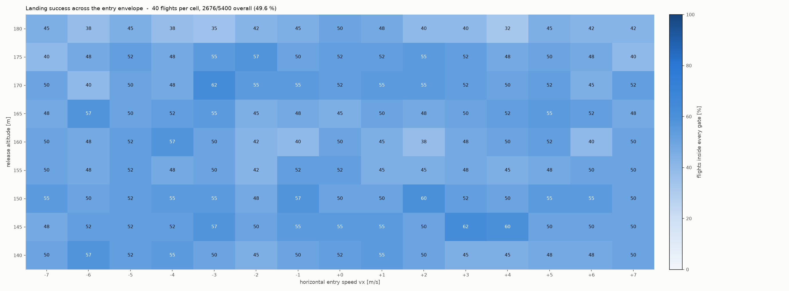
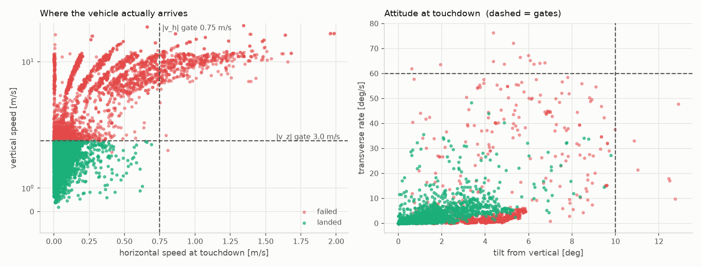
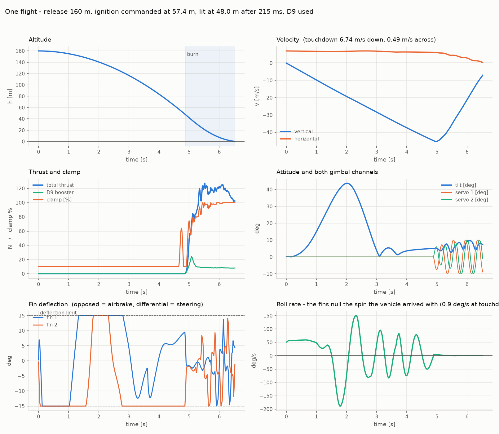
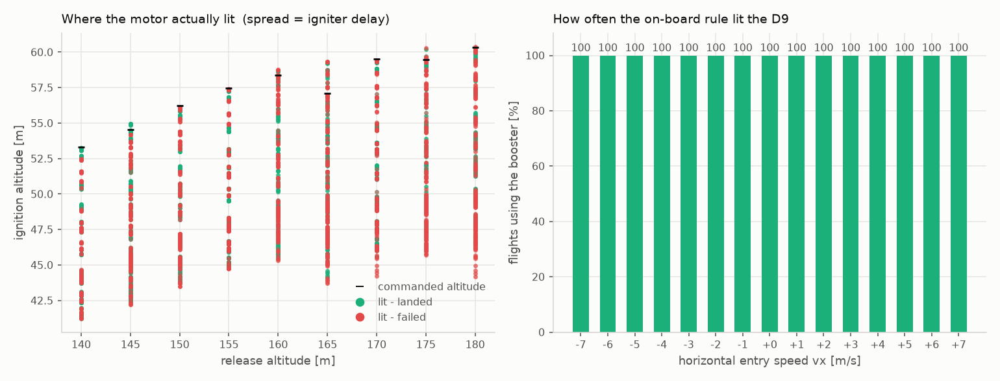
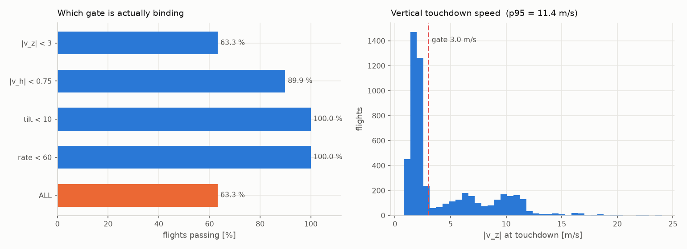

# LandSim Light

1D (vertical axis only) simulation of a propulsive landing of a small rocket with
a solid motor that can only be throttled by thrust-spoiler flaps.

## Model

* Rocket: 3.2 kg gross (277 g propellant), 105 mm diameter, Cd = 0.35, ISA sea-level air.
* Motor: thrust curve reconstructed from the fraction-of-peak / rise-time / decay-time
  table by linear interpolation between the tabulated points
  (burn ≈ 2.61 s, peak 120.4 N, total impulse ≈ 222 Ns).
* Throttling: flaps block up to 90 % of the thrust, so the effective thrust is
  `throttle * F_motor(t)` with `throttle ∈ <0.1, 1.0>`. The blocked thrust is
  **wasted** – the propellant burns according to the nominal curve, so the burn
  time and the mass history do not depend on the throttle setting.
* The throttle profile is split into 100 ms phases; every phase has its own value.

## What it computes

For a free fall from a configurable altitude (default 150 m) it searches, with a
vectorised differential-evolution optimiser over the throttle profile, the range of
ignition altitudes for which a touchdown below 3 m/s is achievable, and prints the
lowest and the highest such altitude together with the throttle / thrust profile.

## Extra knobs

* `--motor long|short` (GUI: radio buttons) switches between the two motor lookup
  tables — both burn the same 277 g of propellant:
  * **long** – 120.4 N peak, 2.613 s burn, 221.8 Ns
  * **short** – 269.4 N peak, 1.554 s burn, 258.8 Ns
* `--thrust-mult` (GUI: *Thrust multiplier*) scales the whole motor lookup table by a
  float > 0 before the simulation starts; everything else (burn time, mass history)
  stays as it is.
* `--search-min` / `--search-max` (GUI: *Search from* / *Search to*) limit the range of
  ignition altitudes that is searched.
* The feasible set is treated as a single contiguous window, so the coarse scan stops
  at the first failure after a series of successes.
* The report also gives the time from the release down to each of the two ignition
  altitudes and the resulting time window for the ignition command.

## Klima D9 boosters (third mode)

On top of the throttled main motor the rocket may carry up to N **Klima D9**
boosters (curve from the manufacturer's RockSim file: 25 N peak, 2.242 s, 19.96 Ns,
27.1 g each, 16.1 g of it propellant). A booster is a pure on/off device: the
optimiser only chooses *whether* and *when* to light each one — once lit it burns
its whole curve and cannot be throttled, stopped or relit, and it may just as well
stay unused for the whole flight. The carried boosters' mass is added to the rocket
(`--no-booster-mass` turns that off).

* CLI: `--boosters 0..N`, `--booster-window` (how long after the main ignition a
  booster may still be lit, default main burn + 4 s).
* GUI: the *Klima D9 boosters* spinbox with its own ignition-window box.

With the long motor and the default vehicle the window of usable ignition altitudes
grows from 45.4–56.3 m (no booster) to 41.9–61.6 m (1) and 37.4–67.1 m (3).

## Side calculation: apogee from the ground

`ascent(cfg, throttle)` simulates a vertical launch from rest at ground level with
the same vehicle, motor and drag model and returns the apogee, the burnout state,
the peak speed and the peak acceleration. It is completely separate from the
landing search.

* CLI: printed before every run; `--ascent` runs only this, `--ascent-throttle`
  sets a constant throttle.
* GUI: the **Apogee from ground** button with its own throttle box.

With the default vehicle: **long** motor -> apogee ≈ 171 m (burnout 70.7 m, 45.8 m/s),
**short** motor -> apogee ≈ 264 m (burnout 61.7 m, 67.3 m/s, 7.8 g).

---

# 3-D / TVC mode (`tvc_sim.py`)

The 1-D modes ask *whether a soft landing is possible at all*. This one asks whether a
real controller flies it. Structure, gains and several of the hard-won details follow
[Landing-Rocket-Sim](https://github.com/Tomasraketak/Landing-Rocket-Sim); the vehicle,
the motor, the throttle clamp and the D9 booster are this project's.

## What is modelled

* **Two translational axes** (vertical z, horizontal x) and the **full attitude problem
  in 3-D**: the airframe rolls at U(0, 90) deg/s in either direction with no actuator
  able to stop it. Attitude is carried as two body-fixed unit vectors - the thrust axis
  `b` and a transverse reference `g` that marks the roll orientation - never as Euler
  angles, because the two servos are bolted to the airframe and their axes roll with it.
* **Fin control**: four all-moving NACA 0012 fins, +/-15 deg in 90 ms, 0.50 m aft of
  the CG - steering, the only roll authority on the vehicle, and airbrakes. See the
  section below.
* **Two TVC channels**: +/-10 deg servo through a 2:1 linkage -> +/-5 deg of nozzle,
  500 deg/s, 2000 deg/s^2, 0.15 deg quantisation, on a 0.70 m arm.
* **Aerodynamics**: axial force plus a slender-body normal force with the CP 0.35 m aft
  of the CG, so the airframe weathercocks nose-first - that is the disturbance the TVC
  fights - plus transverse (never roll) aero damping.
* **The throttle clamp** of the 1-D modes (10-100 %, diverted impulse wasted, burn
  duration fixed) and **one Klima D9** lit by an on-board rule.
* **Dispersions**: igniter delay U(0, 300 ms), instantaneous thrust scatter up to
  +/-15 % correlated over a 700 ms window, roll rate U(0, 90) deg/s, and the entry grid
  (release 140-180 m in 5 m steps, vx 0 to +/-7 m/s in 1 m/s steps). Avionics sensor
  noise is deliberately **not** modelled - the controller sees the true state.

Touchdown must pass all five gates: |vz| < 3 m/s, |vh| < 0.75 m/s, tilt < 10 deg,
transverse rate < 60 deg/s, and actually be on the ground. The rate gate reads the
**transverse** rate only: roll is uncontrollable by design and does not tip the vehicle.

## Guidance

* ZEV-style commanded thrust **direction** with drag credit and an altitude-dependent
  tilt cone (capped at 20 deg - much tighter than the reference's 45 deg, because this
  vehicle's vertical margin cannot pay for a wide one).
* Cascade attitude loop on the error rotation vector `e = asin|b x u| * unit(b x u)`,
  inner rate loop on the gyro, gyroscopic decoupling of the roll-induced cross-axis
  torque, and **dynamic inversion** `s = (b x tau)/(L*T)` so one gain set stays valid
  across a 100:1 thrust range. omega_n = 9 rad/s, zeta = 1.
* **A receding-horizon clamp level, re-solved at 10 Hz**: "the constant clamp that,
  applied from now on, puts me on the pad at 0.5 m/s", held for 0.3 s with full clamp
  assumed afterwards. The reference's four-segment coast-then-slam ladder is the wrong
  family here - the grain cannot be saved, so what has to be shaped is the tail.
* **The D9 rule**: the booster is lit only when the plan says the main motor cannot
  close the landing even at full clamp. It cannot then be throttled, stopped or relit.

## Fin control

Four all-moving cruciform fins (the airframe's own geometry: 120 mm root, 63 mm tip,
70 mm span, 26.6 deg sweep), NACA 0012, **+/-15 deg with 90 ms end stop to end stop**,
mounted **0.50 m aft of the CG**. Deflection limit, travel time, arm and the whole
planform are editable in the GUI and on the command line.

They do three different jobs, and the mixer keeps them separate:

```
delta_i = roll + A*cos(phi_i) + B*sin(phi_i)   +   brake * (+1,-1,+1,-1)
          \____________ control ____________/       \___ pure drag ___/
```

* **Steering.** A and B are solved from the torque the gimbal *cannot* deliver -
  the whole demand while the motor is unlit, and whatever is left when the nozzle is
  at its stop. The fins' own crossflow angle of attack is cancelled in the mixer, the
  same dynamic inversion the nozzle gets, done in the fin's variable: without it the
  commanded deflection and the delivered angle of attack differ by the vehicle's
  sideslip and the two actuators limit-cycle against each other.
* **Roll**, which the gimbal provably cannot touch. A slow rate damper (1.5 rad/s,
  capped at 2 deg of travel): the roll inertia is 0.004 kg m^2, so one degree of fin
  is worth ~800 deg/s^2 and a loop sized by authority instead of by inertia demands
  more than a 333 deg/s actuator can track.
* **Airbrakes.** Splayed +,-,+,- the set cancels its own lift and roll torque and
  leaves pure drag: **free-fall Cd 0.581 against 0.350 bare, 1.66x**. Control is
  allocated first and the brake takes what travel is left.

### Why a splayed airbrake rolls the vehicle - and how it was fixed

The splay pattern (+,-,+,-) is roll-neutral **only while every fin sits at the same
|angle of attack|**, because the roll moment is the plain sum of the four fin forces
and the lift curve is odd. With sideslip the crossflow adds to one fin of a pair and
subtracts from the other, so equal angles of attack need *unequal deflections* - and
once the fins stall (15 deg of splay plus the sideslip of a weathercocking airframe is
past stall), a pattern of equal deflections stops cancelling. Measured on the fin
model, four fins at a plain +/-15 deg:

| sideslip | roll moment | with the crossflow cancelled in the command |
|---|---|---|
| 2 deg | 0.025 N m | -0.001 |
| 10 deg | 0.221 N m | -0.003 |
| 30 deg | 0.651 N m | 0.011 |

Those look tiny until you divide by the roll inertia, `m*R^2/2 = 0.004 kg m^2`:
0.2 N m held for one second is 45 rad/s. That is the whole story of the 340 deg/s
spin-up seen in the first version.

The fix is in the mixer, and it is two lines: the crossflow correction is applied to
every fin, and **the brake magnitude is equalised across the set** (the tightest fin's
remaining travel sets it for all four) instead of each fin getting whatever room it
happens to have left. Squeezing the fins into unequal travel is what re-created the
unequal angles the correction had just removed. Roll excursions during the free fall
went from 200-340 deg/s to 30-80 deg/s, and the roll damper takes them from there.

The residual is real, not numerical: at large sideslip the correction needs more than
+/-15 deg (at 20 deg of sideslip it asks for 36 deg) and the fins simply saturate.
That is why the attitude loop also stays asleep for most of the free fall - it wakes
40 m above the commanded ignition altitude, far enough to settle, late enough that the
long descent is flown at trim instead of at a fought-for attitude.

### Do the fins save the motor from steering with its own thrust?

Yes, and it is measurable - it is just a small term on this vehicle. The steering loss
`dV = integral T(1 - u_z)/m dt` is what the burn gives away by not pointing straight up:

| | dV spent on steering | \|vh\| gate | p95 \|vh\| |
|---|---|---|---|
| with fins | **0.37 m/s** | 87.2 % | 1.07 m/s |
| without fins | 0.57 m/s | 75.2 % | 1.45 m/s |

The fins carry the attitude work the gimbal would otherwise have to do, and the
horizontal channel lands twice as tightly. But against ~70 m/s of usable dV, half a
metre per second of steering loss was never the thing standing between this vehicle
and a landing - the thrust scatter is.

### Aerodynamic drift nulling: implemented, measured, does not pay

The obvious next step is to kill the sideways velocity **before** ignition with the
airframe's own normal force - free, no propellant. It is implemented
(`--fin-drift-null`) and it is off by default, because it does not work here:

* entry drift at ignition, 160 m release with vx = +7 m/s: **6.2 m/s with it, 6.2 m/s
  without**. All of that reduction is plain drag along the flight path.
* success on the coarse grid: 41.0 % with, 43.0 % without.

Two reasons, both structural. An all-moving fin has to spend the body's angle of attack
on cancelling its own crossflow before it can steer at all, so past ~10 deg of trim the
set saturates - asymmetrically, which puts the roll straight back (18 deg of commanded
tilt re-introduced 290 deg/s of spin). And the airframe is statically stable enough
that what the fins *can* hold is a few degrees, worth under 1 m/s^2 of side force,
most of which is spent damping the weathercock oscillation rather than accumulating in
one direction.

### The D9 is canted 15 degrees

The booster is not axial: it is canted 15 deg and aimed **through the CG**, so it makes
no moment, but 25.9 % of its thrust goes sideways and only 96.6 % of its impulse
upwards - and, being bolted to the airframe, that side force **rotates with the roll**.
The planner is handed the axial component only; the controller feeds the lateral one
forward, because the flight computer knows it lit the booster and knows which way the
airframe points, so the cant is a known input rather than a disturbance to be
discovered through the velocity error. Without that feedforward the cant costs 5 points
of \|vh\| and 4 of tilt; with it, most of that comes back.

The cant is not free even so - against an axially mounted D9, all else equal:

| | success | \|vz\| | \|vh\| | dV on steering |
|---|---|---|---|---|
| D9 canted 15 deg | 44.9 % | 46.5 | 87.2 | 0.37 m/s |
| D9 axial | 49.6 % | 49.6 | 91.3 | 0.25 m/s |

It costs about 4-5 points, and it costs them in the vertical channel: 3.4 % of the
booster's impulse never points up, and the main motor has to lean to cancel what does
go sideways. Both `--booster-cant` and `--booster-azimuth` are settable.

## Results (5400 flights, 135 entry states x 40)



| | |
|---|---|
| success, all five gates | **44.9 %** |
| \|vz\| < 3 m/s | 46.5 % (p95 11.8 m/s) |
| \|vh\| < 0.75 m/s | 87.2 % (p95 1.07 m/s) |
| tilt < 10 deg | 98.8 % (p95 7.3 deg) |
| transverse rate < 60 deg/s | 99.3 % (p95 46 deg/s) |
| D9 lit | 100 % of flights |
| dV spent on steering | 0.37 m/s (clamp waste 9.2 m/s) |

**Success is within two points of the vertical gate.** With fin control the attitude
problem is essentially closed - tilt and rate pass ~99 % of the time and the roll the
vehicle arrived with is nulled every flight - and what is left is propulsive. (With an
axially mounted D9 the two are identical, at 49.6 %; the 15 deg cant is what opens the
gap - see below.)

Turning one thing off at a time (16 flights x 25 cells each, common random numbers):

| configuration | success | \|vz\| | \|vh\| | tilt | rate | p95 rate |
|---|---|---|---|---|---|---|
| fins + airbrake (default) | **46.2 %** | 46.2 | 86.8 | 99.8 | 99.8 | 39 deg/s |
| fins, brake deployed all flight | 46.2 % | 48.2 | 84.2 | 98.5 | 93.5 | 64 |
| fins, no airbrake | 45.0 % | 46.8 | 84.8 | 99.0 | 97.5 | 53 |
| **no fins at all** | **40.0 %** | 41.0 | 78.8 | 98.8 | 96.5 | 55 |
| fins, no D9 booster | 13.2 % | 13.2 | 42.0 | 99.8 | 99.0 | 7 |
| fins, no thrust scatter | **85.5 %** | 85.8 | 99.5 | 99.8 | 100.0 | 16 |

* **The fins are worth about 6 points** and they buy it in the vertical channel, not
  the attitude one: the airbrake takes energy out of the free fall before the motor
  ever lights.
* **The D9 is worth 33 points.** Without it the main motor alone cannot close this
  landing from 140-180 m at all - 13 %.
* **The +/-15 % thrust scatter is still the dominant term**, worth ~39 points on its
  own. It is what stands between this vehicle and a solved problem.

The band of usable ignition altitudes is about 14 m wide and the 300 ms igniter
spread is about 13.5 m of it, so no command altitude covers every delay. Sweeping the
commanded ignition altitude by hand at 150 m / vx = 0 put the optimum at **56-58 m**,
and the planner picks **56.6 m** by itself - the pre-flight logic is right, the
vehicle is short of margin.






## Running it

```
python3 tvc_sim.py                       # the default campaign + figures
python3 tvc_sim.py --runs 10 --h-step 20 --vx-step 3.5   # quick look
python3 tvc_sim.py --motor short         # the 269 N / 1.55 s motor
python3 tvc_sim.py --boosters 0          # without the D9
python3 tvc_sim.py --no-fins             # gimbal only, roll uncontrolled
python3 tvc_sim.py --fin-deflect 20 --fin-travel 0.05 --fin-brake always
python3 tvc_sim.py --save run.npz        # ... and redraw later with --load run.npz
python3 tvc_sim.py --verify              # model invariants
```

`--verify` checks what an aggregate success rate cannot show: the gimbal basis stays
orthonormal (7e-15), the dynamic inversion round-trips (1e-15), the inherited roll
survives the whole flight untouched **with the fins disabled** - nothing else in the
model makes a torque about the body axis - and with them enabled the same spin is
nulled to well under 1 deg/s by touchdown.

### Speed

The flight kernel (`fly`, the planner projections, the fin aerodynamics) is compiled
with **numba** when it is installed - about 14 ms per trajectory, so a 5400-flight
campaign takes ~12 minutes on four cores' worth of one core. Without numba the same
code runs as plain Python, roughly 40x slower, which is the difference between a
coffee and a weekend. The 3-D tab of the GUI uses exactly the same compiled kernel and
says at the top which of the two it got; if it is red, `pip install numba`.

The first call spends a few seconds compiling - that is normal, and the cache makes
later runs in the same environment start immediately.

The 1-D modes need no numba: their optimiser simulates the whole population at once as
numpy arrays.

`matplotlib` is needed for the figures. Everything is in `requirements.txt`.

---

## Usage

```
python3 landsim.py                                  # default 150 m case
python3 landsim.py --drop-alt 200 --max-touchdown 3
python3 landsim.py --coarse-step 5 --gen 200 --pop 80 --tol 0.1   # higher quality
```

Requires only `numpy`.

## GUI

```
python3 gui.py
```

A minimal Tkinter window where you can edit the drop altitude, initial velocity,
gross and propellant mass, diameter (or the reference area directly), Cd, air
density, the soft-landing limit, the minimum throttle, the phase length, the
integration step and the optimiser settings. It runs the search in a background
thread (with a Stop button and a live progress log) and shows the two resulting
ignition altitudes together with the speed at ignition and the touchdown speed,
plus the throttle / thrust profile for each.

Tkinter ships with the standard Python installers on Windows and macOS; on Debian/
Ubuntu install it with `sudo apt install python3-tk`.
